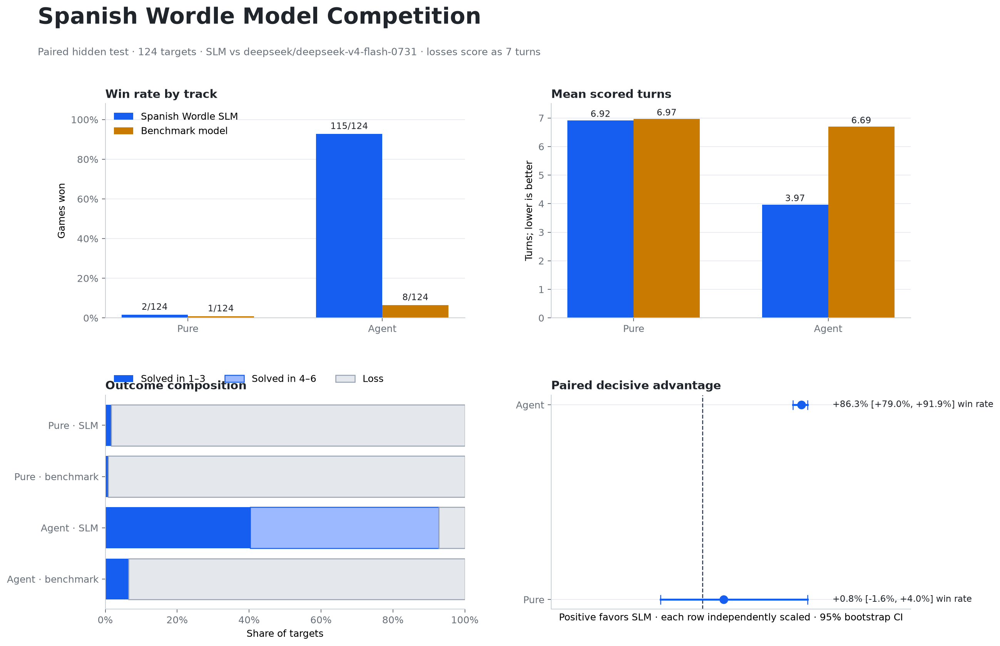
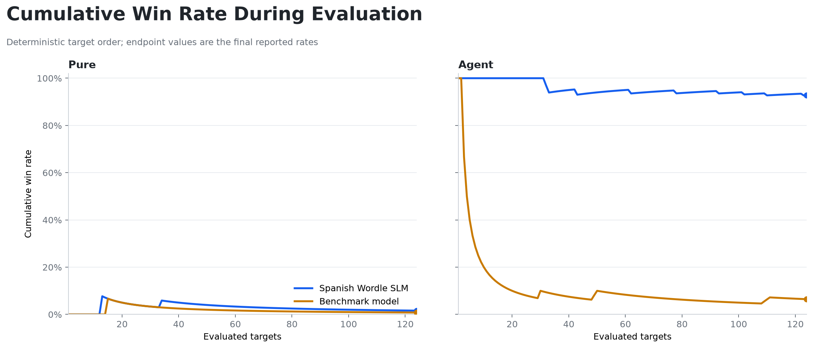

# Spanish Wordle SLM benchmark

## Technical summary

**Experimental objective achieved:** no. The frozen MLX adapter was compared with `deepseek/deepseek-v4-flash-0731` on the same 124 hidden Spanish Wordle targets. A track counts as won only when the paired 95% bootstrap interval is positive for the first metric that differs: win rate first, then mean turns with losses scored as seven.

## Findings

| Track | Model | Wins | Win rate | Mean scored turns | Invalid actions | Tool calls | Cost |
|---|---|---:|---:|---:|---:|---:|---:|
| Pure | Spanish Wordle SLM | 2/124 | 1.6% | 6.92 | 325 | 0 | $0.0000 |
| Pure | deepseek/deepseek-v4-flash-0731 | 1/124 | 0.8% | 6.97 | 63 | 0 | $0.0186 |
| Agent | Spanish Wordle SLM | 115/124 | 92.7% | 3.97 | 21 | 477 | $0.0000 |
| Agent | deepseek/deepseek-v4-flash-0731 | 8/124 | 6.5% | 6.69 | 31 | 24 | $0.0159 |

| Track | Decisive metric | Win-rate difference | Turn advantage | Paired 95% CI | Decision |
|---|---|---:|---:|---:|---|
| Pure | win_rate | 0.8% | 0.05 | [-1.6%, 3.2%] | not demonstrated |
| Agent | win_rate | 86.3% | 2.73 | [79.8%, 91.9%] | SLM wins |

## Scope and metric definitions

- **Pure:** the model receives only the guess/feedback history and must emit a valid five-letter guess.
- **Agent:** the same loop, with at most one `get_candidates` call per turn; no best-move metric is exposed.
- **Win rate:** solved within six turns. A loss contributes seven turns to the mean.
- **Paired decision:** 10,000 bootstrap resamples of the shared target set with seed `20260814`.

## Model and experiment

- Local policy: `LiquidAI/LFM2.5-2.6B-MLX-6bit` with the frozen selected LoRA adapter and no-thinking inference template.
- Benchmark policy: `deepseek/deepseek-v4-flash-0731`, temperature 0, low reasoning, seed `20260814`, 512 output-token cap, and OpenRouter fallback disabled.
- Harness: `@earendil-works/pi-agent-core@0.84.2`; at most two invalid-output repairs per turn.
- Source results: `slm-pure.json`, `deepseek-pure.json`, `slm-agent.json`, and `deepseek-agent.json`.

## Limitations and robustness

- Statistical uncertainty is reported from paired target-level outcomes; it does not generalize beyond the fixed Spanish answer distribution without further evaluation.
- Network latency and OpenRouter cost are observational and may vary; game outcomes use deterministic decoding but hosted provider infrastructure can still change.
- Checkpoint and prompt decisions were made on validation only. The hidden test was opened after freezing the adapter and benchmark configuration.

## Next steps

Retrain or revise using training and validation only, freeze a new adapter, then rerun the full hidden test without changing the victory criterion.
