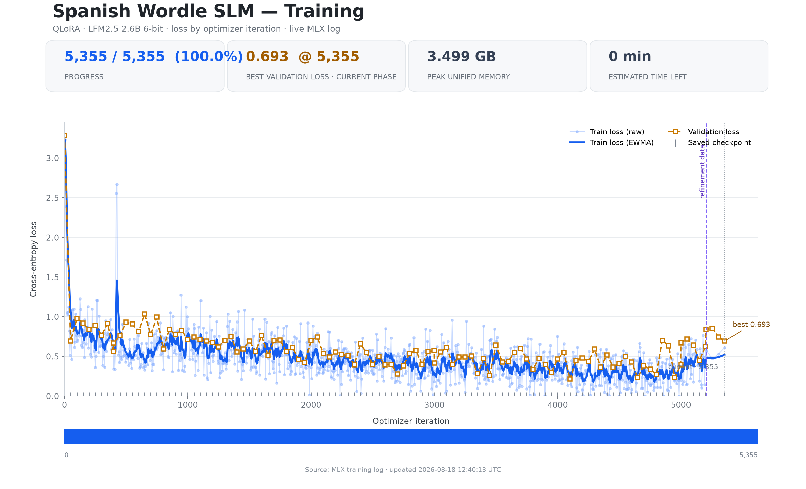
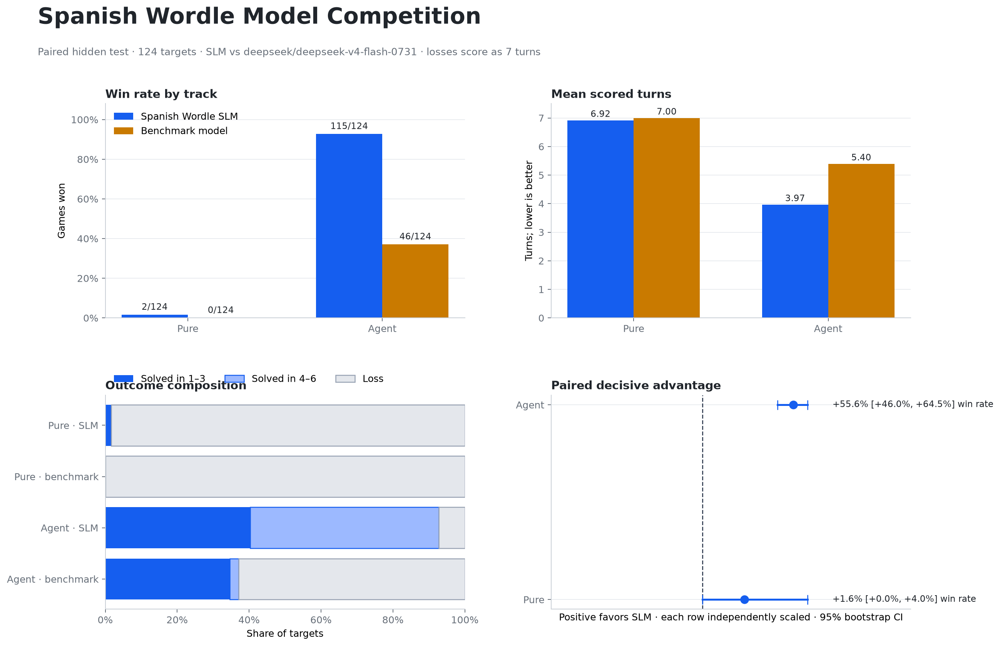
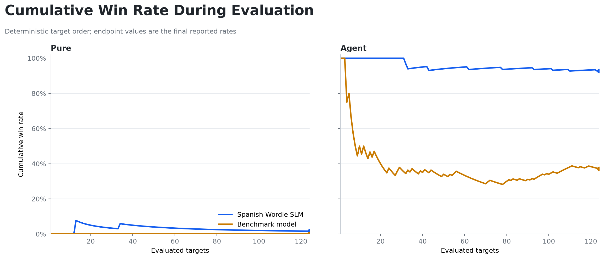
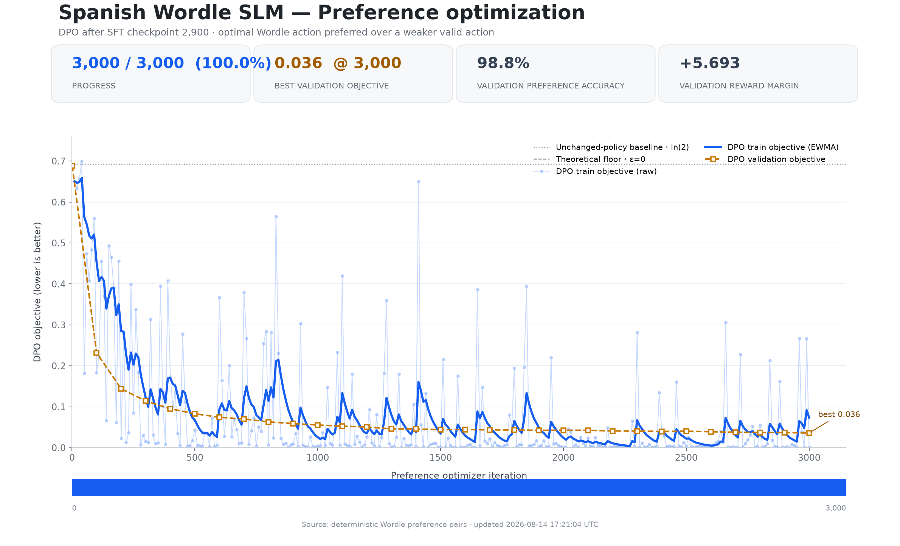

# Spanish Wordle SLM en MLX: decisiones, resultados y aprendizajes de extremo a extremo

**Fecha de cierre de esta retrospectiva:** 19 de agosto de 2026  
**Proyecto:** Spanish Wordle SLM  
**Estado:** infraestructura reproducible y track Agent demostrados; objetivo competitivo de dos tracks no conseguido.

## Resumen ejecutivo

Este documento reconstruye el proyecto desde la primera hipótesis hasta el último preflight remoto. No es un informe de marketing ni una selección de los experimentos que salieron mejor: incluye las decisiones descartadas, los resultados incompletos, los errores de cuota, los cambios de arquitectura, las pruebas que confundieron la pérdida con la capacidad de jugar y las reglas que se fijaron para no volver a cometerlos.

La pregunta original era ambiciosa y deliberadamente concreta: comprobar si un único adapter QLoRA de `LiquidAI/LFM2.5-2.6B-MLX-6bit`, ejecutado localmente en Apple Silicon, podía superar a un modelo remoto mucho mayor jugando Wordle español. La condición de éxito no era “el modelo aprende” ni “gana alguna partida”. El mismo adapter tenía que ganar a su rival en **Pure** y en **Agent**, sobre los mismos objetivos ocultos, con una métrica y un intervalo estadístico fijados antes de abrir el test.

La conclusión actual es negativa para la afirmación completa, pero positiva para varias partes técnicas importantes:

- El modelo, el entorno aislado, el checkpoint, el solver, el bridge Python/TypeScript, el servidor MLX y el harness de evaluación son reproducibles.
- El solver Oracle resuelve las 616 soluciones normalizadas en un máximo de cinco turnos, con media aproximada de 3,03.
- El adapter seleccionado aprendió el protocolo Agent: en el benchmark Flash limpio ganó 115 de 124 partidas.
- El cuello de botella es Pure: sin candidatos ni herramientas el adapter solo ganó 2 de 124 partidas frente a 0 de Flash; la diferencia observada no tiene un intervalo bootstrap estrictamente positivo.
- Docenas de variantes de SFT, DPO, GRPO-lite, DAgger, ranking y cambios de formato redujeron pérdidas o mejoraron la obediencia sintáctica sin cambiar de forma útil la primera acción autoregresiva.
- La comparación con Pro se volvió inválida por errores de proveedor y crédito. Las smokes de Tencent HY3 y GPT-5.6 Luna también fueron rechazadas antes de inferencia por crédito insuficiente; no existe un benchmark aceptado de esos modelos.

Por tanto, el proyecto terminó en el estado correcto: **resultado experimental no conseguido, evidencia técnica conservada y criterio no relajado**.

## 1. La pregunta inicial y sus límites

### 1.1 Qué se quería demostrar

La hipótesis era que la especialización de un modelo pequeño, junto con un entorno Wordle determinista y un entrenamiento cuidadosamente controlado, podía superar a un modelo grande generalista en una tarea estrecha. La idea no era demostrar que un 2,6B es superior en general, sino que una política especializada podía convertir mejor el historial de feedback en una siguiente jugada.

La investigación inicial añadió una segunda hipótesis: el checkpoint post-entrenado de Liquid estaba diseñado para uso con herramientas, así que podía ser más competitivo como agente que como jugador puro. De ahí nació la separación explícita entre tres tracks.

### 1.2 Tracks congelados

| Track | Entrada disponible | Acción permitida | Qué mide |
|---|---|---|---|
| Pure | Historial de palabras y feedback | Emitir una palabra de cinco letras | Política interna de selección sin ayuda externa |
| Agent | Historial y herramientas de candidatos compatibles | Como máximo una llamada `get_candidates` por turno; el modelo decide | Uso disciplinado de herramientas y protocolo agente |
| Oracle | Historial y `best_guess()` | El solver devuelve la jugada óptima | Techo del sistema; no cuenta para la afirmación |

Pure no podía consultar candidatos, word bank, entropía, solver ni una métrica de la mejor jugada. Agent no podía llamar a `best_guess`; si el solver elige por el modelo, se está midiendo al solver y no al modelo. Oracle se publicó únicamente como referencia de techo.

### 1.3 Criterio de victoria

El criterio se fijó antes del test oculto:

1. Se juega en exactamente los mismos 124 objetivos del split de test.
2. Se cuenta primero la tasa de victorias en seis turnos.
3. Solo si la tasa empata se compara la media de turnos.
4. Una derrota cuenta como siete turnos en la media.
5. La primera métrica que difiere debe favorecer al SLM con un intervalo bootstrap pareado del 95 % estrictamente positivo.
6. Se requieren cero errores de proveedor en los resultados remotos aceptados.
7. El rival, la semilla, la temperatura, el límite de tokens, el parser, las reparaciones y el fallback deben estar congelados.

Un archivo que diga `complete=true` pero contenga respuestas 402, 429, 502 o timeouts no es un benchmark válido. Una muestra de 1, 5 o 10 objetivos sirve para decidir si se detiene una rama, pero nunca para afirmar una victoria. Un Agent ganador no compensa un Pure perdido.

## 2. Decisiones de arquitectura tomadas al principio

### 2.1 Por qué MLX y por qué un entorno aislado

El objetivo operativo era entrenar en un Mac con memoria unificada y mantener el entrenamiento dentro de seis horas. El Python global tenía incompatibilidades binarias, por lo que se eligió `uv` y un entorno virtual aislado. Se fijó `mlx-lm==0.31.3` junto con NumPy, Matplotlib, PyYAML, Pytest y Ruff.

El modelo elegido fue `LiquidAI/LFM2.5-2.6B-MLX-6bit`, revisión HF `95f71f1c30e3247bc7f042c6fd64d7ca60258780`. La investigación inicial lo describía como un modelo de 2,69B parámetros, 30 capas, contexto largo, soporte de function calling y entrenamiento con distillation on-policy y agentic RL. En local el archivo de pesos fijado ocupa 2.191.851.544 bytes y su SHA256 es:

```text
c78541214b57816a6b97b7676db7943b036b65b6edfce5fdf0181bb76b25646a
```

La decisión conceptual fue separar el checkpoint de inferencia rápida de un posible maestro BF16. En la práctica, el entrenamiento se hizo sobre el checkpoint MLX cuantizado usando QLoRA porque era la opción reproducible dentro del Mac y del presupuesto temporal. La arquitectura dejó abierta una futura conversión desde un maestro no cuantizado, pero no se necesitó para la entrega actual.

### 2.2 División Python/TypeScript

La investigación recomendaba no forzar un único lenguaje. Se mantuvo esa decisión:

- Python para datos, feedback, matriz, solver, entrenamiento MLX, inferencia local y estadísticas.
- TypeScript para el harness Pi, el loop de partidas remotas, las herramientas Agent, la persistencia de juegos y los informes.
- `@earendil-works/pi-agent-core@0.84.2` como runtime mínimo; no se usó el coding agent completo porque añadir filesystem, shell y prompts de programación habría contaminado la tarea.

La frontera es un proceso `mlx_lm.server` compatible con la API OpenAI. El motor Python también puede funcionar como proceso JSONL persistente con operaciones `feedback`, `get_candidates` y `best_guess`. Así el entorno no depende de la implementación interna del modelo y el mismo loop puede apuntar al SLM o a OpenRouter.

### 2.3 Interfaz CLI y artefactos

Se construyó una CLI reproducible con estas superficies principales:

- `prepare-data`: descarga/normaliza fuentes y genera manifiestos.
- `validate`: comprueba feedback, matriz, splits, tokenización y solver.
- `download-model`: descarga el checkpoint fijado y verifica tamaño/hash.
- `train`: ejecuta smoke, calibración y entrenamiento con watchdog.
- `train-preference`, `train-action`, `train-action-margin`, `train-ranker` y `train-word-first`: ramas experimentales aisladas.
- `serve`: levanta el servidor local con el adapter seleccionado.
- `benchmark`: ejecuta un track y persiste una partida después de cada objetivo.
- `report`: calcula métricas y decide si el criterio está cumplido.
- `visualize-training`, `visualize-preference` y `visualize-benchmark`: generan PNG, SVG y JSON de estado.

Los pesos base, caches HF, `.env`, credenciales y checkpoints de exploración quedan ignorados. El repositorio conserva código, lockfiles, manifiestos, datos derivados pequeños, CSV, informes y resúmenes.

## 3. Datos y motor Wordle

### 3.1 Fuentes fijadas

Se fijaron dos fuentes públicas por commit:

- 617 filas históricas de soluciones Wordle ES de `adrian154/blog@093fe54b...`.
- 11.180 intentos válidos de `cjsaavedra76/WORDLE-ES-resolver_csr@c85f31b...`.

La normalización hace minúsculas NFC, repara el mojibake de `ñ`, conserva la `ñ`, elimina entradas que no tengan exactamente cinco letras y quita duplicados. La lista histórica contiene 617 filas y 616 respuestas únicas porque `apoyo` aparece dos veces. Se comprobó que todas las soluciones pertenecen al vocabulario de intentos.

El manifiesto `data/processed/provenance.json` conserva procedencia, hashes y recuentos antes y después. En los artefactos procesados se observan 616 respuestas, 11.088 intentos normalizados y una matriz exhaustiva.

### 3.2 Feedback exacto

El feedback se implementó en dos pasadas:

1. Primera pasada para marcar coincidencias verdes y descontar letras exactas.
2. Segunda pasada para asignar amarillos solo mientras quede disponibilidad de la letra.

Esto evita el error clásico de contar dos veces una letra repetida. Los 243 patrones posibles (`3^5`) se codifican en `uint8`. Se comparó la función escalar con la matriz precomputada sobre todos los pares relevantes; la validación quedó marcada como exhaustiva.

### 3.3 Matriz y solver

La matriz intento × solución se precomputó para convertir el cálculo de feedback en accesos de memoria. El solver usa entropía en estados amplios y minimax con memoización en estados pequeños. Es determinista y conserva el orden de desempate.

La validación Oracle resolvió las 616 soluciones, no tuvo fallos, alcanzó un máximo de cinco turnos y una media de 3,034 turnos. Ese resultado fue importante porque aisló el motor de Wordle: el problema no era la semántica de `ñ`, los duplicados ni el filtro de candidatos.

### 3.4 Split y seguridad de datos

El split es determinista con semilla `20260814`:

| Split | Respuestas |
|---|---:|
| Train | 431 |
| Validación | 61 |
| Test oculto | 124 |

Los datasets derivados guardan `hidden_test_used=false`, hashes de train/valid y ausencia de solapamiento de prompts. El test no se abrió para elegir checkpoints. Solo se consultó después de congelar adapter, prompt, parser, sampling y harness.

## 4. Diseño de entrenamiento

### 4.1 Primer SFT y selección del adapter

La primera línea de trabajo fue SFT multitarea con aproximadamente 60 % Pure, 30 % Agent y 10 % Oracle, usando el chat template nativo de LFM y pérdida solo sobre la respuesta. El entrenamiento principal tuvo:

| Parámetro | Valor seleccionado |
|---|---:|
| LoRA rank | 16 |
| LoRA scale | 32 |
| Dropout | 0,05 |
| Capas adaptadas | Últimas 16 |
| Longitud máxima | 512 |
| Learning rate principal | 3e-5 |
| Limpieza Pure | 150 iteraciones a 1e-5 |
| Seed | 20260814 |
| Pico de memoria | 3,499 GB |

La configuración inicial del plan mencionaba rank 8, scale 16, últimas 8 capas y `2e-5`; las calibraciones demostraron que el Mac podía sostener más capacidad sin acercarse a 14 GB, así que se seleccionó la configuración rank16/16 capas. La decisión no fue gratuita: se mantuvo el límite temporal, checkpoints frecuentes y una evaluación de validación para no prolongar una rama inestable.

El adapter congelado en `adapters/selected` procede de `pure-clean-refinement`. Su SHA256 es:

```text
6c7a48c8fa56b1f08fa4f902e7c044e520aec672c71952ff489db85113cb71c6
```

El checkpoint seleccionado no se sobrescribe durante exploraciones. Todas las variantes se guardan en carpetas separadas.

### 4.2 Smoke, calibración y watchdog

Antes del entrenamiento completo se ejecutaron 20 iteraciones de smoke y una calibración de memoria/tiempo. El watchdog calcula iteraciones posibles y aplica un presupuesto acumulativo de 5 h 45 min, incluida calibración. El estado contiene iteración, tiempo consumido, checkpoints, pérdida, memoria y configuración; una reanudación conserva el presupuesto restante. `caffeinate` mantiene despierto el Mac.

La corrida principal alcanzó 5.355 iteraciones y generó 105 checkpoints. El estado final registra:

| Métrica | Valor |
|---|---:|
| Train loss última | 0,611 |
| Train loss suavizada | 0,521 |
| Validation loss | 0,693 |
| Mejor validation loss | 0,693 en la iteración 5.355 |
| Velocidad aproximada | 0,3015 iter/s |
| Pico de memoria | 3,499 GB |

### 4.3 Visualización de la pérdida

La visualización se amplió porque una curva aislada no permitía distinguir train, validación, fases de refinamiento, checkpoints, memoria ni tiempo. Se generaron PNG y SVG, un JSON de estado y un JSONL normalizado. El dashboard marca fases y conserva una curva acumulada para reanudaciones.



*Figura 1. Curva de pérdida del entrenamiento principal. La versión vectorial está disponible en [loss-curve.svg](../artifacts/training/loss-curve.svg).*

Durante las iteraciones apareció un suelo visual cercano a 0,2 en algunas curvas. La explicación no era que el modelo hubiese alcanzado un “error mínimo de Wordle”: era la combinación de pérdida de tokens, suavizado visual, subconjunto supervisado y cambios de fase. Una loss de token puede bajar mientras el modelo sigue eligiendo una palabra equivocada. Por eso se corrigió el dashboard para separar series y se dejó de usar la forma de la gráfica como criterio de promoción.

La curva de pérdida sirve para detectar divergencia, NaN, cambios de fase y sobreajuste; no sirve por sí sola para decidir qué adapter juega mejor. El caso DPO lo demostró con especial claridad.

### 4.4 El “error mínimo cero” y por qué no se convirtió en objetivo operativo

Se exploró la petición de llevar la pérdida a cero, incluyendo DPO sin label smoothing. Se documentó la distinción matemática: con pesos finitos, cero es una infimum asintótica, no una garantía alcanzable. Además, forzar una loss token-level a cero puede memorizar el dataset y empeorar el argmax real.

La selección final quedó subordinada a partidas de validación completas y al criterio estadístico. El watchdog, la validación y la integridad de la interfaz tienen prioridad sobre consumir todas las iteraciones.

## 5. Harness y evaluación

### 5.1 Loop común

Pi usa el mismo bucle para SLM y rival. Cada partida persiste su historial, feedback, acción, reparación, latencia, tokens, coste, proveedor efectivo y errores. El modelo remoto se fija a temperatura 0, semilla `20260814`, razonamiento bajo, máximo 512 tokens y sin fallback.

Se permiten como máximo dos reparaciones por turno ante una salida inválida. Después la partida se puntúa como derrota. Agent puede pedir candidatos una vez por turno. Oracle puede pedir `best_guess` y se presenta como techo.

### 5.2 Pure y Agent son preguntas diferentes

El Agent tiene una ventaja estructural permitida: recibe la lista de palabras compatibles. Su resultado responde si el modelo sabe usar una herramienta y escoger desde una lista. Pure responde si el modelo puede reconstruir esa lista implícitamente a partir del historial.

No se mezclaron los resultados. En particular, el 92,7 % de victorias Agent no se usó para afirmar que el SLM “juega mejor” en general.

### 5.3 Gráficas y reportes

El report genera tablas por track, diferencia observada, media con pérdidas como siete, intervalo bootstrap pareado y un booleano de éxito. La visualización produce dashboard de competición, progreso acumulado, CSV de partidas y mapa de gráficos. Los gráficos Flash se mantienen separados de los antiguos Pro para no mezclar modelos, errores ni contratos.

## 6. Historia experimental completa

La siguiente tabla resume las familias de cambios. Los resultados pequeños son señales de descarte, no victorias.

| Familia | Hipótesis | Evidencia principal | Decisión |
|---|---|---|---|
| SFT Pure limpio | Más trayectorias correctas deben enseñar la política | `pure-clean-long`: 3/61 en validación; hidden 1/124 | Mejor señal pública, pero no promover |
| Currículos y mezclas | Variar dificultad y cobertura mejora generalización | 0–1/61 en varias ramas; acciones genéricas persistentes | Rechazar más SFT equivalente |
| Rank/capacidad amplia | Más capas o rank arreglan capacidad | Wide rank32/30 capas: loss menor, inestabilidad y 1/10 | Rechazar |
| Prompt con restricciones | Hacer explícitas letras verdes/amarillas/grises ayuda | 0/10 en formatos legibles y deterministas | Rechazar |
| Word-only | El JSON distrae de la palabra | 0/61; menos inválidas pero peor política | Rechazar cambio de formato aislado |
| Constrained decoder | Eliminar palabras ilegales arregla Pure | 0/10 aun con palabras válidas | Cuello no es sintaxis |
| Candidate list | Varias propuestas aumentan probabilidad de acertar | 1/10, 6,5 turnos, 25 inválidas | Desactivado por defecto |
| Word bank | Dar respuestas globales reduce búsqueda | 0/3, incompleto y lento | No es Pure aceptable |
| Repair list | Generar hasta 12 alternativas rescata inválidas | 1/9, archivo `complete=false` | Solo hipótesis pendiente |
| Fixed opening `audio` | El problema es la primera palabra `careo` | 0/10 desde base; luego 0/10 | Apertura no explica todo |
| Fixed opening `careo` | Evitar conflicto del historial vacío | 1/10, igual al baseline corto | No cambia la política |
| Thinking/scratchpad/explain | Razonar visible ayuda a filtrar | Historiales vacíos o 1/5 | Mantener no-thinking y JSON corto |
| Temperatura/penalización | Decoding menos repetitivo mejora jugadas | Igual o peor; menos inválidas no implica ganar | No cambiar contrato congelado |
| GRPO-lite | Recompensar reducción de candidatos mueve acciones | 1/10, 25 inválidas | Loss no se transfiere |
| GRPO perturbado | Entrenar recuperación de estados no ideales ayuda | 1/10, igual que GRPO base | No repetir sin cambiar decoding |
| DAgger on-policy | Enseñar estados producidos por el propio modelo cierra la brecha | 1/61, 152 inválidas; hidden 2/124 | Mejora marginal, no promoción |
| DAgger word-only/grid | Representación más directa o visual ayuda | 0/61 en ambos | Rechazar |
| DPO on-policy | Preferencias chosen/rejected mejoran ranking | val loss 0,587, margen 0,247; 1/61 | Loss preferencial no predice partidas |
| Margen de tokens | Ponderar primeros tokens fuerza la palabra | Tras 100 iteraciones loss 0,135, margen 5,265; 1/10 | Memorización sin cambio de argmax |
| Ranking compacto | Fijar ocho acciones y comparar negativos estabiliza | loss 1,976→1,212; 0/10 y 32 inválidas | Coste y política no justifican continuar |
| Currículo Oracle deduplicado | Eliminar conflictos de prompt permite aprender acción | 0/10 desde base; LR mayor no cambia | El dataset no es el único problema |
| Word-first | Multiplicar por ocho la pérdida de tokens de palabra | 1/10, 25 inválidas; loss sube 1,033→1,811 | Rechazar antes de ampliar |

### 6.1 Lo que enseñaron las ramas SFT

Se generaron datasets Pure deterministas, plain, con restricciones, con trayectorias óptimas, con currículos de hasta 102.079 registros y con estados deduplicados. Se controlaron conflictos de etiquetas, solapamiento train/valid y uso del test. El patrón se repitió: la validación de tokens mejoraba, pero el servidor seguía arrancando con palabras frecuentes (`careo`, `lenta`, `macla`, `crack`, `abuso`) y después repetía o emitía palabras no compatibles.

La interpretación cambió de “faltan iteraciones” a “la señal supervisada no controla la primera acción que realmente decodifica MLX”. Continuar a ciegas habría consumido horas sin cambiar la evidencia pública.

### 6.2 Lo que enseñaron GRPO-lite y DAgger

GRPO-lite calculó recompensas offline por grupo para acciones legales, incluyendo resolver o reducir candidatos, sin exponer candidatos al modelo. Las trayectorias perturbadas añadieron estados producidos por acciones compatibles aleatorias. DAgger recogió rollouts on-policy con el adapter congelado y añadió dos tandas de 100 objetivos train.

Estos métodos sí cambiaron las curvas: hubo pérdidas negativas en el objetivo de política, validaciones mejores y diversidad de acciones. Sin embargo, el modelo continuó decodificando una primera palabra genérica y no aplicó las restricciones de forma robusta. La diferencia entre una ventaja en la loss y el argmax autoregresivo fue el aprendizaje central del proyecto.

### 6.3 Lo que enseñaron DPO y el ranking de acciones

DPO construyó pares con la jugada del solver como `chosen` y la jugada real del adapter como `rejected`, manteniendo el mismo historial. Alcanzó baja pérdida y margen positivo, pero la partida pública quedó idéntica a DAgger: 1/61.

El ranking de acciones y el margen a nivel de token intentaron concentrar el gradiente en la palabra, no en llaves y comillas del JSON. Se resolvieron problemas de compilación Metal reduciendo capas y fijando secuencias. Aun así, 100 iteraciones memorizaron los pares sin cambiar la palabra generada. La conclusión no es que DPO o ranking sean inútiles en general, sino que estas implementaciones no resolvieron la brecha entre score entrenado y decoding real.

## 7. Benchmark oficial frente a Flash

El cambio de regla operativo fue explícito: no volver a Pro hasta superar primero `deepseek/deepseek-v4-flash-0731`. Se fijó Flash como rival, se desactivaron fallbacks y se probaron proveedores homogéneos.

### 7.1 Problemas de rate limit y ensamblado

La primera corrida sin provider pin recibió 429 repartidos entre DigitalOcean y StreamLake y se detuvo. Después se fijó un único proveedor, se añadieron reintentos solo para errores transitorios (`429`, `engine_overloaded`, timeout de proveedor), con esperas 5/10/20 segundos, y se repitieron tres objetivos que habían sufrido timeout.

Las corridas parciales no se trataron como derrotas. El ensamblador verifica cobertura, orden canónico, ausencia de solapamientos, modelo, track y prefijo de objetivos. Solo la pareja final con `errors=0` se usó para el informe.

### 7.2 Pareja Flash limpia

Los artefactos canónicos son `artifacts/benchmark/deepseek-flash-pure.json` y `artifacts/benchmark/deepseek-flash-agent.json`. Ambos cubren los mismos 124 objetivos y tienen cero errores.



*Figura 3. Dashboard comparativo de Pure y Agent frente a `deepseek/deepseek-v4-flash-0731`. La versión vectorial está disponible en [competition-dashboard-flash.svg](../artifacts/benchmark/competition-dashboard-flash.svg).*

| Track | SLM | Flash | Lectura |
|---|---:|---:|---|
| Pure, victorias | 2/124 | 0/124 | Diferencia observada pequeña |
| Pure, tasa | 1,61 % | 0 % | IC [0,00; 4,03] pp: no demostrado |
| Pure, media puntuada | 6,92 | 7,00 | Ventaja de 0,08, no decisiva porque la tasa difiere |
| Pure, inválidas | 325 | 302 | El SLM produce más salidas no válidas |
| Agent, victorias | 115/124 | 46/124 | Ventaja amplia del SLM |
| Agent, tasa | 92,74 % | 37,10 % | IC [+45,97; +65,32] pp: gana el SLM |
| Agent, media puntuada | 3,97 | 5,40 | Confirma la ventaja |
| Agent, tool calls | 477 SLM | 227 Flash | El SLM usa correctamente la herramienta permitida |

El coste remoto aproximado fue 0,0793 USD en Pure y 0,1162 USD en Agent. La latencia y el coste son observacionales y no forman parte de la decisión primaria.



*Figura 4. Progreso acumulado por objetivo durante la evaluación Flash. La versión vectorial está disponible en [competition-progress-flash.svg](../artifacts/benchmark/competition-progress-flash.svg).*

### 7.3 Por qué el resultado no es una victoria completa

El SLM gana Agent con un intervalo claramente positivo, pero Pure tiene límite inferior cero. Por el criterio fijado, el informe correcto es `success=false`. No se cambió el criterio después de ver las cifras, no se sustituyó Flash por Pro y no se convirtió el Agent en una afirmación general.

Una discrepancia histórica importante quedó documentada: algunos manifiestos de adapter contienen conteos de una ejecución anterior de Flash (por ejemplo, otra cifra de victorias del rival en Agent). Los informes `summary-flash.*`, generados desde la pareja limpia de 124 objetivos y `errors=0`, son la fuente canónica del scoreboard. No se deben mezclar metadatos de checkpoints anteriores con la tabla final.

## 8. Pro, proveedores y cuota: lo que no se pudo concluir

### 8.1 DeepSeek Pro

El benchmark inicial Pro produjo archivos con errores de proveedor. Las corridas antiguas tenían 27 errores en Pure y 54 en Agent; una revalidación actual de Pure cubrió 124 objetivos pero registró 56 errores, principalmente crédito insuficiente y 502 de Novita. Un archivo con 124 filas y `complete=true` no pasa el contrato si `errors != 0`.

Se hicieron smokes con Novita, Alibaba, Fireworks, DigitalOcean y el endpoint primario de DeepSeek. Se observó que OpenRouter reserva el máximo de salida: reducir solo el número de objetivos no evita un 402 si la clave no puede afrontar 512 tokens. Se añadió `OPENROUTER_MAX_TOKENS` para smokes, manteniendo 512 en el contrato oficial. Alibaba tuvo la menor latencia en una ventana y DigitalOcean pasó a ser preferido por soporte de herramientas y una latencia posterior menor; ninguna de esas mediciones constituye una victoria competitiva.

La lección operativa fue dejar de reintentar masivamente. Primero se consulta cuota de forma segura, después se hace una smoke Pure y otra Agent, y solo con `errors=0` se lanzan los 124 objetivos.

### 8.2 Tencent HY3 y GPT-5.6 Luna

Se inspeccionó la metadata de `tencent/hy3` y `openai/gpt-5.6-luna`. Ambos tenían endpoints y soporte de herramientas. La smoke de Tencent en DeepInfra falló antes de inferencia con HTTP 402 por `Insufficient credits`. Para GPT-5.6 Luna, Amazon Bedrock devolvió 404 de routing para la revisión servida; al probar OpenAI, la smoke volvió a fallar con HTTP 402.

Los artefactos quedaron `complete=false`, saneados y separados de los benchmarks oficiales. No se puede afirmar que ninguno de esos modelos haya ganado o perdido: no llegó a producir una partida comparable.

### 8.3 El aumento de límite no equivale a crédito consumible

La auditoría segura llegó a mostrar un límite de 5 USD, uso aproximado de 2,909 USD y restante calculado de 2,091 USD, pero el error seguía identificando `openrouter_credits` como fuente insuficiente. El aprendizaje es distinguir límite de gasto, crédito utilizable y presupuesto reservado por petición. Aumentar el límite visible no garantiza que el upstream acepte una generación.

La configuración actual vuelve a Flash:

```text
OPENROUTER_MODEL=deepseek/deepseek-v4-flash-0731
OPENROUTER_PROVIDER_ONLY=digitalocean
OPENROUTER_MAX_TOKENS=512
```

No se escribió un ID nuevo para HY3 o Luna en `.env`, así que no existe un benchmark nuevo de esos modelos.

## 9. Qué salió bien

### 9.1 Reproducibilidad y controles

- `uv` aisló el problema de dependencias binarias del Python global.
- El checkpoint HF quedó fijado por revisión, tamaño y hash.
- La matriz y el solver pasaron comprobaciones exhaustivas.
- El split train/valid/test fue determinista y el test se mantuvo cerrado durante la selección.
- Las pruebas Python, TypeScript, build y Ruff se mantuvieron verdes en las comprobaciones finales.
- Los checkpoints, JSONL y estados permiten reanudar sin perder el presupuesto acumulado.

### 9.2 Infraestructura de evaluación

- Pi Agent Core ofreció un loop idéntico para local y remoto.
- El bridge JSONL separó entorno y modelo.
- El parser, las reparaciones y el registro de herramientas quedaron observables.
- Los errores remotos se distinguieron de derrotas reales.
- Las corridas se pueden dividir y ensamblar sin aceptar gaps, overlaps o drift de modelo.

### 9.3 Resultado Agent

El resultado Agent no es un detalle menor. Con el mismo base y el mismo adapter que falla en Pure, el modelo gana 115/124 frente a 46/124 de Flash y mantiene una media puntuada 3,97 frente a 5,40. Esto demuestra que:

1. El feedback exacto funciona.
2. La lista de candidatos se calcula correctamente.
3. El modelo sabe seguir el protocolo de tool calling.
4. El servidor y el parser no están globalmente rotos.
5. La especialización local sí tiene valor cuando el estado relevante se expone.

## 10. Qué salió mal y por qué

### 10.1 Se optimizó la métrica equivocada durante demasiado tiempo

La pérdida de entrenamiento, la pérdida de validación, el margen DPO, la accuracy de preferencias y la pérdida GRPO respondían a objetivos internos. Ninguna era la métrica de victoria. Se tardó en imponer la regla de que una rama solo puede continuar si cambia una partida pública completa.

El ejemplo más extremo fue el margen de tokens: después de 100 iteraciones la validación de pares mostraba `valid_loss=0,1354` y margen `5,2652`, pero la evaluación Pure seguía en 1/10, exactamente como el smoke. El modelo memorizó la preferencia, no aprendió a aplicar feedback en el decoding real.



*Figura 2. Curvas de pérdida y margen de la fase DPO. Esta gráfica se conserva como diagnóstico de optimización, no como evidencia de mejora de partidas. La versión vectorial está disponible en [dpo-curves.svg](../artifacts/preference/dpo-curves.svg).*

### 10.2 El problema no era únicamente el formato

Se probaron JSON corto, palabra sola, scratchpad, explicación, grid de colores, restricciones legibles y decoder restringido. Algunas variantes redujeron inválidas o loss, pero ninguna aprendió la acción correcta. El modelo puede producir una palabra de cinco letras válida y aun así ignorar una letra verde o repetir una letra descartada.

El formato de inferencia final se dejó corto y sin thinking porque sí hubo variantes con `<think>` que consumían el presupuesto y devolvían historial vacío. Eso arregla la interfaz, no la estrategia.

### 10.3 La apertura es un síntoma, no la causa completa

El adapter seleccionado tendía a `careo`. Fijar `audio` desde base produjo 0/10; fijar `careo` en todos los historiales eliminó la ambigüedad del primer ejemplo, pero terminó en 1/10. La apertura influye, pero el fracaso posterior es una falta de selección condicionada al feedback.

### 10.4 El entorno remoto introdujo ruido externo

429, 402, 404, 502 y timeouts consumieron tiempo y cuota. La primera respuesta fue probar proveedores y reintentos; la respuesta correcta acabó siendo más conservadora: provider pin, fallback desactivado, smokes separadas, saneado de errores y no interpretar parciales.

### 10.5 Artefactos parecidos no eran comparables

Hubo archivos con 61 objetivos, 10 objetivos, 5 objetivos, diferentes límites de tokens y distintos upstreams. También quedaron manifiestos con conteos de una ejecución anterior. La solución fue asignar un nombre nuevo a cada diagnóstico, exigir `errors=0`, fijar prefijos y distinguir `complete=true` de “aceptado”.

### 10.6 El presupuesto temporal se podía gastar en compilaciones

Las formas dinámicas de MLX provocaron compilaciones Metal de varios minutos. El ranking de acciones llegó a tardar más de ocho minutos antes de escribir una segunda métrica; el margen dinámico se atascó más de cuatro minutos en `value_and_grad`. Reducir capas y fijar padding solucionó la compilación, pero la señal de juego siguió sin mejorar.

La lección es hacer primero un smoke de gradiente con formas finales y medir tiempo por iteración antes de comprometer cientos de iteraciones.

## 11. Aprendizajes generalizables

### 11.1 Loss no es política

Una loss puede bajar porque el modelo aprende llaves JSON, tokens frecuentes, una apertura dominante o pares de preferencias. Wordle exige una decisión discreta condicionada por todos los feedbacks anteriores. La métrica de selección debe observar la palabra realmente emitida por el servidor.

### 11.2 Pure y Agent requieren objetivos distintos

Agent aprende una interfaz con estado explícito. Pure necesita aprender una operación de filtrado implícita o una representación que haga esa operación accesible. Es un error entrenar Agent y suponer que el comportamiento se transfiere a Pure.

### 11.3 El primer token importa desproporcionadamente

Si la primera palabra es incorrecta, el modelo recibe un feedback distinto al de la trayectoria supervisada. La política entra en un estado fuera de distribución. Las trayectorias perturbadas y DAgger ayudan a describir ese problema, pero no lo resolvieron con el decoder actual.

### 11.4 La sintaxis es una compuerta, no la meta

Eliminar acciones inválidas es útil para el análisis, pero una palabra legal y no compatible sigue siendo una acción mala. El decoder restringido confirmó esta distinción.

### 11.5 Los datos derivados deben conservar trazabilidad

Cada rama debe registrar fuente, seed, hashes, `hidden_test_used`, prompt, adapter de inicio, LR, capas, secuencia, número de iteraciones y criterio. Sin eso, una curva o una cifra aislada no se puede auditar.

### 11.6 El benchmark debe ser más difícil de alterar que de ejecutar

Es preferible tardar en ensamblar una corrida a aceptar rápidamente un JSON contaminado por 429. El resultado limpio frente a Flash fue posible porque los reintentos, shards y reglas de unión trataron la cobertura como una invariante.

### 11.7 El crédito forma parte del diseño experimental

La cuota no es un detalle de despliegue. Si no se puede garantizar una smoke sin error y una pareja homogénea, el rival no está definido operacionalmente. Cambiar de modelo sin crédito solo cambia el mensaje de error.

## 12. Reglas que quedan congeladas para no repetir errores

Antes de cualquier entrenamiento, cambio de prompt, parser o benchmark hay que:

1. Leer este artículo y `docs/experimental-learning-log.md` completos.
2. Comprobar que no haya `mlx_lm.server`, entrenamiento o benchmark huérfano.
3. Guardar el SHA de `adapters/selected`.
4. Declarar hipótesis, dataset, adapter de inicio, seed, LR, capas, secuencia, nombre y criterio.
5. Hacer smoke de memoria/gradiente y estimar tiempo.
6. Evaluar una muestra corta solo como parada temprana; si hay señal, completar 61 objetivos de validación.
7. No abrir test oculto si no existe una mejora reproducible en validación completa.
8. No usar candidatos, solver, word bank o `best_guess` en Pure.
9. Separar todo cambio de política en un track nuevo si altera la información disponible.
10. Seleccionar checkpoints por partidas de validación y pérdida, nunca por test.
11. No promover una loss baja sin observar una palabra mejor generada.
12. No reintentar OpenRouter sin revisar modelo efectivo, proveedor, cuota y coste reservado por `max_tokens`.
13. Saneear errores para que no contengan claves, URLs sensibles o identificadores de crédito.
14. Regenerar build, tests, Ruff, hashes, informe y gráficas al cerrar una rama.

## 13. Estado final de entrega

### Código y entorno

El proyecto tiene lockfiles, entorno aislado, CLI Python, harness TypeScript, tests, configuración de entrenamiento y documentación. Las comprobaciones relevantes finales fueron verdes:

```bash
npm run build
npm test
uv run pytest -q
uv run ruff check src/wordle_slm
```

### Modelo y adapter

- Base: `LiquidAI/LFM2.5-2.6B-MLX-6bit` en revisión fijada.
- Adapter seleccionado: `adapters/selected`.
- SHA del adapter: `6c7a48c8fa56b1f08fa4f902e7c044e520aec672c71952ff489db85113cb71c6`.
- Los adapters experimentales no se mezclan con el seleccionado.
- Los pesos base no se copian al repositorio Git.

### Benchmark

- Flash: pareja Pure/Agent limpia, 124 objetivos, `errors=0`, informe y gráficas separados.
- Pro: histórico y reintento actual rechazados por errores de proveedor/crédito.
- Tencent HY3: smoke 402, sin benchmark.
- GPT-5.6 Luna: Bedrock 404 de routing y OpenAI 402, sin benchmark.
- Resultado global: `success=false` de forma correcta.

### Publicación y secretos

El código y los derivados pequeños se mantienen separados de `.env`, cachés, pesos y checkpoints. La model card incluye licencia y atribución de LFM. No se guardan claves ni cuerpos de error sensibles en este documento.

## 14. Próximas acciones racionales

No está justificado lanzar otra continuación SFT idéntica ni cambiar de nuevo al modelo Pro. El siguiente trabajo debe elegir una sola hipótesis que cierre la brecha entre entrenamiento y decoding:

- un objetivo de acción con negativos duros que mida la acción que el servidor realmente emite;
- un decodificador Pure explícitamente definido y congelado, reportado como nueva política si usa restricciones externas;
- o un entrenamiento on-policy que recoja el estado real posterior a la primera acción y optimice la partida completa.

En todos los casos se necesita smoke local, validación completa de 61, comparación con el baseline seleccionado y solo después un test oculto de 124. Para reanudar la competición remota, primero hay que escribir el ID rival real en `.env`, comprobar crédito consumible y terminar una smoke Pure y otra Agent con `errors=0`.

La afirmación final solo podrá cambiar de “no conseguido” a “conseguido” si el mismo adapter supera a ese rival en Pure y Agent bajo el criterio congelado. Si no ocurre, el resultado debe publicarse como experimento no conseguido, sin alterar después el test ni seleccionar retrospectivamente otra métrica.

## 15. Mapa de artefactos y comandos de auditoría

### Documentación

- `docs/experimental-learning-log.md`: bitácora cronológica completa, incluida la regla de releer antes de experimentar.
- `README.md`: instrucciones de reproducción y contrato actual frente a Flash.
- `model-card/README.md`: licencia, atribución y descripción del adapter.

### Evidencia de datos y modelo

- `data/processed/provenance.json`: procedencia y hashes de vocabularios.
- `artifacts/model-manifest.json`: revisión, tamaño y hash del checkpoint.
- `artifacts/validation.json`: recuentos, split y comprobación exhaustiva de matriz.
- `artifacts/oracle-validation.json`: verificación del solver.
- `artifacts/adapter-manifest.json` y `artifacts/adapter-selected-sha256.txt`: identidad del adapter.

### Evidencia de entrenamiento

- `artifacts/training/metrics.jsonl`: métricas normalizadas.
- `artifacts/training/status.json`: estado final, tiempo, memoria y checkpoints.
- `artifacts/training/loss-curve.png` y `.svg`: visualización de pérdida.
- `artifacts/preference/dpo-curves.png` y `.svg`: diagnóstico de la fase DPO.
- `artifacts/runs/training/`: smokes, fases y logs.

### Evidencia de benchmark

- `artifacts/benchmark/deepseek-flash-pure.json`.
- `artifacts/benchmark/deepseek-flash-agent.json`.
- `artifacts/benchmark/summary-flash.md` y `.json`.
- `artifacts/benchmark/competition-dashboard-flash.png` y `.svg`.
- `artifacts/benchmark/competition-progress-flash.png` y `.svg`.
- `artifacts/benchmark/competition-games-flash.csv` y `competition-summary-flash.csv`.
- `artifacts/benchmark/technical-report-flash.artifact.json`.

### Reproducción mínima

```bash
uv sync --extra dev
uv run wordle-slm prepare-data
uv run wordle-slm validate
uv run pytest -q
npm install
npm test
npm run build
uv run wordle-slm report
uv run wordle-slm visualize-benchmark --rival-prefix flash
```

Para una nueva rama de entrenamiento, copiar una configuración a un nombre nuevo, ejecutar primero smoke y conservar el adapter seleccionado intacto. Para una nueva competición, verificar la configuración efectiva y crear informes nuevos; nunca sobrescribir el scoreboard histórico con resultados parciales.

## Cierre

El aprendizaje principal no es que “el modelo pequeño no funciona”. Es más preciso: **el sistema pequeño funciona cuando el estado relevante se hace explícito, pero el entrenamiento actual no ha conseguido que el modelo reconstruya ese estado de forma fiable en Pure**. El solver, el Agent y la infraestructura prueban que la tarea está bien definida. Las curvas, los márgenes y las pérdidas prueban que se pueden optimizar objetivos internos. Las partidas prueban que todavía no se ha optimizado la decisión que importa.

La decisión correcta al cerrar esta fase es conservar la evidencia, no maquillar el resultado. El proyecto queda preparado para un siguiente experimento mejor diseñado: una sola hipótesis, una interfaz congelada, una validación completa y una regla de victoria que siga siendo la misma aunque el resultado no sea favorable.
